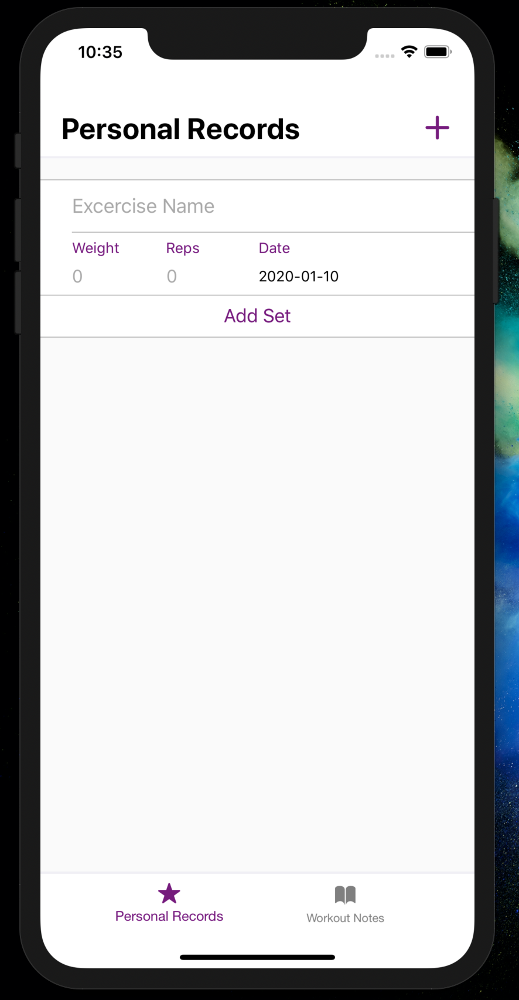
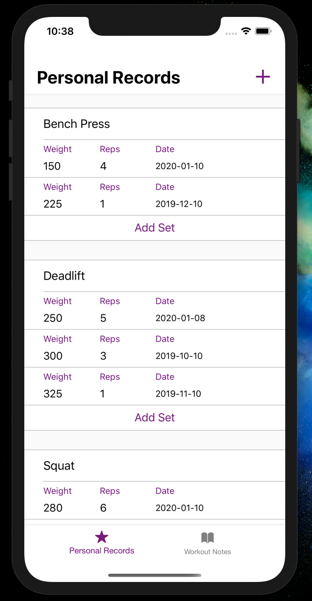
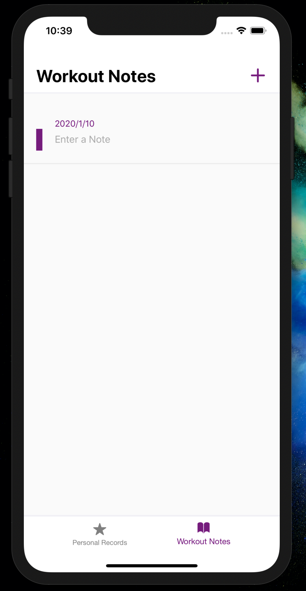
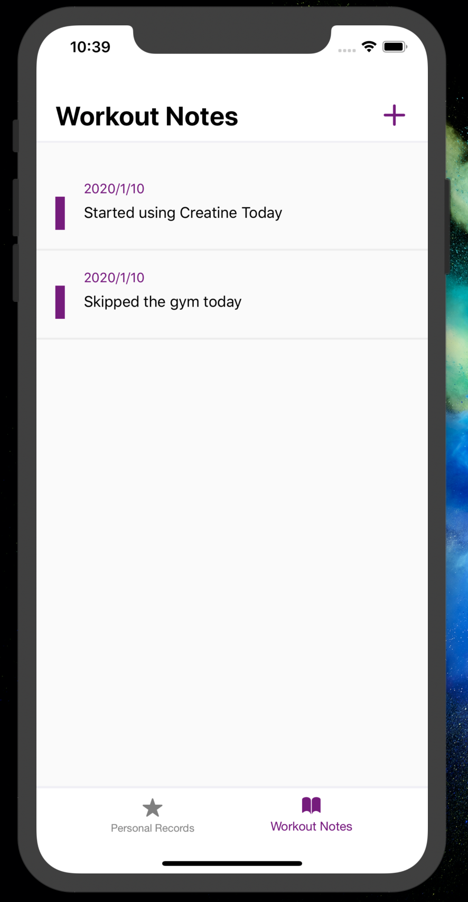

# Trackify! Weight & Reps Tracker

An app designed to write your new gym personal records and create workout notes.

## Current Features & UI
<p float="center">




</p>

## Local Development
### Requirements
 - [Node](https://nodejs.org/en/download/current/)
 - [Expo CLI](https://docs.expo.io/versions/latest/workflow/expo-cli/)

```sh
# Install the dependencies needed
npm install

# Start the app
npm start
```
This will start the development server for you and then you may use the [Expo](https://expo.io/) client app on your iOS or Android device to open the application.
